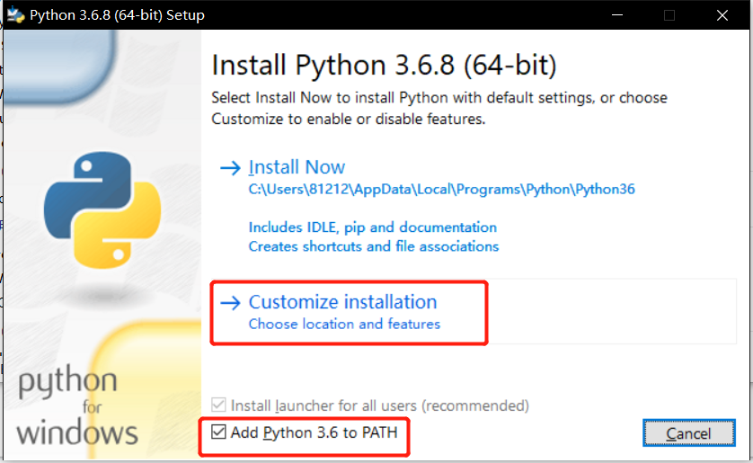
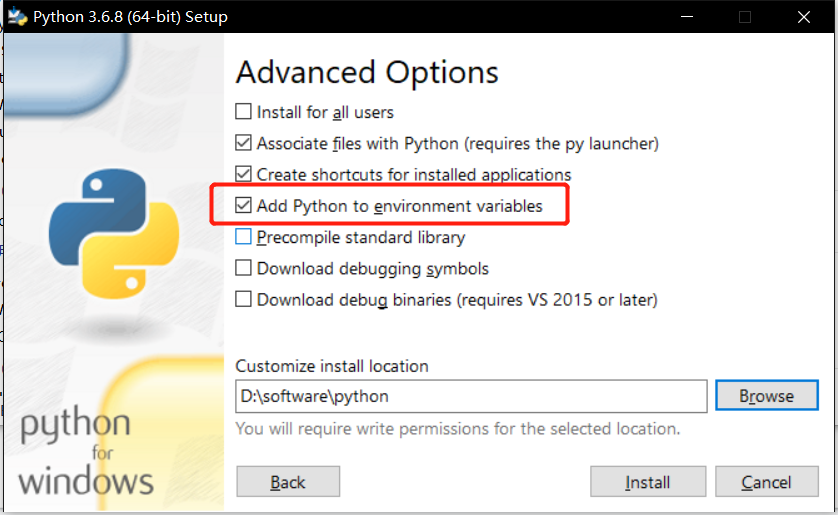
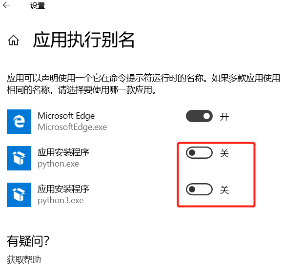

# DataScienceCourse
数据科学与大数据--python入门与爬虫

# 课前准备 :fire: 
> 请根据下面的链接和提示进行进行相关安装和注册做好课前准备 :+1:
- [Chrome](https://www.google.cn/intl/zh-CN/chrome/)
  
    - 安装
- [Microsoft Azure Notebook](https://notebooks.azure.com/)
  
    - 确认自己有可用的微软账号
- [mongoDb Altas 注册账号](https://www.mongodb.com/cloud)
  
    - 注册账户
- [Anaconda](https://www.anaconda.com/)
  
    - 安装
- [python 3.6.8](https://www.python.org/ftp/python/3.6.8/python-3.6.8-amd64.exe)
  
    - 选择自定义的安装方式
    - 
    - 
    - 如果出现跳转商店
      - 打开应用执行别名关掉应用安装程序
      - 
    - check 在终端中python 命令可行
- [vscode](https://code.visualstudio.com/)
    - 安装插件python 
    - 安装插件docker
    - 安装插件Remote Development
- [docker](https://hub.docker.com/?overlay=onboarding)
  
    - 选安装
    - win10 + 打开hyper-v 才能在win环境中使用
    - Linux or MAC 直接安装即可
        - linux用户在本rep下 
        - ```bash
            chmod +x docker.sh
            ./docker.sh
            ```

# 课堂内容
- [Microsoft Azure Notebook](https://notebooks.azure.com/JA1LE1/projects/XMUDataScienceAndBigData)

# 课后作业
## 题目
- 爬取豆瓣动漫类电影评论及相关实体内容

## 步骤
- 获取url池
- 爬取信息
- 存储信息

## url池来源
- [豆瓣动漫类电影](https://movie.douban.com/tag/#/?sort=U&range=0,10&tags=%E5%8A%A8%E6%BC%AB)
    - 关键在于获取js的动态加载内容

## 提醒
- 防止ip被封，可以使用代理
- 每爬一次使用time.sleep()

## 爬取实体
- 评论内容(comment_content)
- 评论星级(comment_star)
- 评论人id(comment_id)
- 评论时间(comment_time)
- 评论点赞数(comment_votes)

## 作业环境
```
pip/anaconda + requirements.txt + 安装mysql/mongo/mongo云(三选一)
或者
docker环境
```

# 实验报告
- [实验报告模板](./实验报告/)

# docker(如果选择docker作为环境)
```
docker-compose up -d
docker exec -it xxx bash (xxx 为python的container id)
```